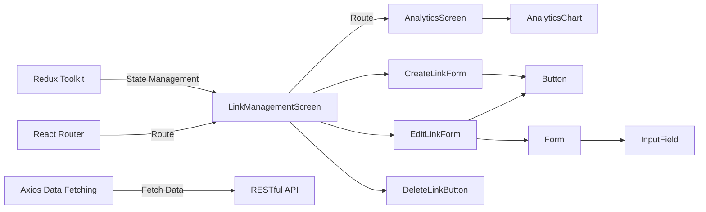
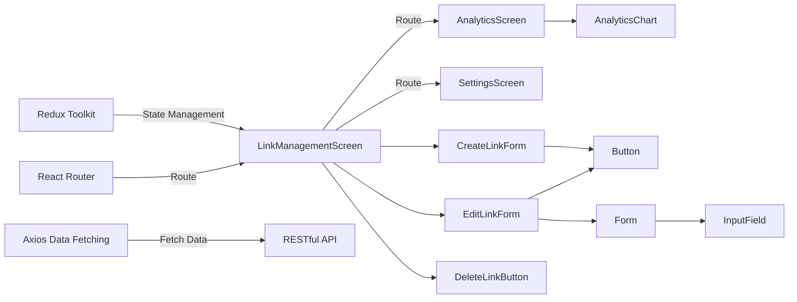
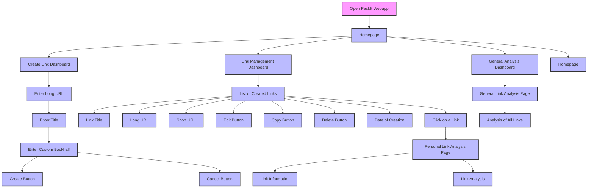

# PackIt App

## Overview

**What does it do?**

**PackIt** is a web application designed to provide users with a comprehensive link shortening service. This powerful tool offers several key functionalities, making it a versatile solution for personal and professional use.

PackIt allows users to:
- **Shorten Links**: Quickly convert long URLs into shorter, more manageable links.
- **Customize Shortened Links**: Personalize the shortened links to make them more memorable and relevant.
- **Generate QR Codes**: Create QR codes for the shortened links, facilitating easy sharing and access via mobile devices.
- **Analyze Link Performance**: Access both detailed and general analytics about the shortened links, including metrics such as click counts, geographic data, and referral sources.

PackIt is designed to be user-friendly, enabling users to manage their links efficiently and gain valuable insights into their link traffic.

## Functionalities of the Project

### Link Shortening
PackIt offers a straightforward process for shortening long URLs. Users simply paste their lengthy URLs into the application and with a single click, PackIt generates a shortened link. This shortened link retains the original destination but is significantly reduced in character count, making it easier to share and manage.

### Customizable Short Links
PackIt provides users the ability to customize their shortened links. Instead of a random string of characters, users can personalize their links with meaningful or branded text. This customization feature is especially useful for marketing purposes, as it enhances brand recognition and link memorability.

### QR Code Generation
For each shortened link, PackIt automatically generates a QR code. Users can download these QR codes and use them in various media, such as print materials, websites, or presentations. Scanning the QR code with a mobile device redirects users to the original URL, providing a seamless experience for mobile users.

### Link Analytics
PackIt includes robust analytics capabilities, offering detailed insights into the performance of each shortened link. Key metrics available to users include:

- **Click Counts**: Total number of clicks on the shortened link.
- **Geographic Data**: Information on the geographical locations of the users clicking the link.
- **Time-based Trends**: Analysis of link activity over time, helping users understand peak engagement periods.

These analytics help users understand their audience better and measure the effectiveness of their link-sharing strategies. By leveraging these insights, users can optimize their content and distribution methods.

### Centralized Link Management
Users can manage all their shortened links in one central location within the PackIt application. This feature allows users to:

- **Edit**: Modify the original or shortened URLs and update the customized text.
- **Copy**: Quickly copy the shortened links to the clipboard for easy sharing.
- **Delete**: Remove links that are no longer needed or relevant.

Centralized link management provides users with an organized and efficient way to handle all their links, ensuring they can easily perform necessary operations.

## Technologies Used

- **React.js version 18**: Our  primary framework for building our  user interface, providing a robust foundation for PackIt's frontend.
- **Vite**: A next-generation build tool that serves as the frontend tooling for fast development and optimized production builds.
- **Redux Toolkit**: A package that helps manage the application state with Redux, providing efficient and predictable state management.
- **PWA (Progressive Web App)**: PackIt is developed as a Progressive Web App, offering an app-like experience to users with features such as offline functionality, push notifications, and more.
- **RESTful API**: Used for communication between the frontend (Reactjs) and the backend services, ensuring a structured and efficient data exchange.
- **Axios**: A promise-based HTTP client for making HTTP requests, commonly used with RESTful APIs in JavaScript applications.
- **Jest and React Testing Library**: Testing frameworks for writing unit and integration tests for React components and Redux state management.
- **Tailwind CSS**: A utility-first CSS framework for styling, enabling rapid and responsive design with minimal CSS.

These technologies collectively empower PackIt to deliver a responsive, scalable, and maintainable web application experience.

### React App Architecture

PackIt employs a component-based architecture to build its user interface and manage application state effectively. Here are the key architectural elements tailored for PackIt:

- **Component-Based Architecture**: PackIt's frontend is composed of reusable UI components that encapsulate specific functionalities. This includes screens for managing shortened links (creation, editing, deletion) and displaying analytics. Smaller components like buttons, forms, and input fields enhance reusability and maintainability.

- **State Management with Redux Toolkit**: Redux Toolkit is employed for managing the application's state. It centralizes state logic, ensuring consistency across components and facilitating actions such as link creation, modification, and analytics updates.

- **Modular and Scalable Design**
The PackIt application is structured in a modular fashion, with each feature or page represented by a separate module. This modular approach enhances maintainability by isolating functionalities and reducing dependencies between different parts of the application.

- **Data Fetching**: PackIt interacts with backend services via RESTful APIs, utilizing Axios for data fetching. This includes retrieving link data, user analytics, and performing operations like link creation and updates.

- **Routing**: Navigation within PackIt is handled by React Router. It manages routing between different screens and components, providing seamless transitions between functionalities such as link management, analytics viewing, and user settings.

## Deployment and Operation

**Deploying and operating the PackIt React app involves several steps:**

- #### Deployment Environment
PackIt is deployed on a cloud platform, providing scalability, reliability, and ease of management. The chosen cloud platform AWS supports the necessary infrastructure for hosting PackIt's frontend, backend, and database services. This environment was selected to leverage cloud-native features such as auto-scaling, managed databases, and comprehensive security options.

- #### Deployment Strategy
PackIt's deployment strategy involves an automated CI/CD pipeline to streamline the process of building, testing, and deploying the application. Tools such as GitHub Actions are used to automate these steps, ensuring consistent and error-free deployments. The deployment pipeline includes:

1. **Build Stage**: Vite builds the React application, optimizing it for production.
2. **Test Stage**: Automated tests are run using Jest and React Testing Library to ensure code quality and functionality.
3. **Deploy Stage**: The built application is deployed to the cloud environment. Containerization with Docker is  used, and orchestrated using Kubernetes for scaling and management.

- #### Monitoring and Logging
Monitoring and logging are critical for maintaining the health and performance of PackIt. Tools like Prometheus and Grafana are used to monitor server performance, application metrics, and resource utilization. Logs are collected and analyzed using the ELK Stack providing insights into application behavior and facilitating troubleshooting.

- #### Backup and Disaster Recovery
PackIt has a comprehensive backup and disaster recovery plan. Regular backups of the database and critical configuration files are scheduled and stored in secure, geographically redundant locations (e.g., cloud storage services). In the event of data loss or disaster, these backups can be quickly restored to minimize downtime and data loss.

- #### Maintenance and Updates
Routine maintenance tasks, such as applying security patches, updating dependencies, and performing system upgrades, are scheduled during off-peak hours to minimize impact on users. Rolling updates and blue-green deployment strategies are employed to ensure zero-downtime deployments, providing a seamless experience for users.

## User Workflow and Interaction

### User Interface:
**The PackIt app offers a user-friendly interface that facilitates efficient link management and various operations related.**  
**The wireframes of the layouts are:**
# PackIt App

## Overview

**What does it do?**

**PackIt** is a web application designed to provide users with a comprehensive link shortening service. This powerful tool offers several key functionalities, making it a versatile solution for personal and professional use.

PackIt allows users to:
- **Shorten Links**: Quickly convert long URLs into shorter, more manageable links.
- **Customize Shortened Links**: Personalize the shortened links to make them more memorable and relevant.
- **Generate QR Codes**: Create QR codes for the shortened links, facilitating easy sharing and access via mobile devices.
- **Analyze Link Performance**: Access both detailed and general analytics about the shortened links, including metrics such as click counts, geographic data, and referral sources.

PackIt is designed to be user-friendly, enabling users to manage their links efficiently and gain valuable insights into their link traffic.

## Functionality of the Project

### Link Shortening
PackIt offers a straightforward process for shortening long URLs. Users simply paste their lengthy URLs into the application, and with a single click, PackIt generates a shortened link. This shortened link retains the original destination but is significantly reduced in character count, making it easier to share and manage.

### Customizable Short Links
PackIt provides users the ability to customize their shortened links. Instead of a random string of characters, users can personalize their links with meaningful or branded text. This customization feature is especially useful for marketing purposes, as it enhances brand recognition and link memorability.

### QR Code Generation
For each shortened link, PackIt automatically generates a QR code. Users can download these QR codes and use them in various media, such as print materials, websites, or presentations. Scanning the QR code with a mobile device redirects users to the original URL, providing a seamless experience for mobile users.

### Link Analytics
PackIt includes robust analytics capabilities, offering detailed insights into the performance of each shortened link. Key metrics available to users include:

- **Click Counts**: Total number of clicks on the shortened link.
- **Geographic Data**: Information on the geographical locations of the users clicking the link.
- **Time-based Trends**: Analysis of link activity over time, helping users understand peak engagement periods.

These analytics help users understand their audience better and measure the effectiveness of their link-sharing strategies. By leveraging these insights, users can optimize their content and distribution methods.

### Centralized Link Management
Users can manage all their shortened links in one central location within the PackIt application. This feature allows users to:

- **Edit**: Modify the original or shortened URLs and update the customized text.
- **Copy**: Quickly copy the shortened links to the clipboard for easy sharing.
- **Delete**: Remove links that are no longer needed or relevant.

Centralized link management provides users with an organized and efficient way to handle all their links, ensuring they can easily perform necessary operations.

## Technologies Used

- **React.js**: Our  primary framework for building our  user interface, providing a robust foundation for PackIt's frontend.
- **Vite**: A next-generation build tool that serves as the frontend tooling for fast development and optimized production builds.
- **Redux Toolkit**: A package that helps manage the application state with Redux, providing efficient and predictable state management.
- **PWA (Progressive Web App)**: PackIt is developed as a Progressive Web App, offering an app-like experience to users with features such as offline functionality, push notifications, and more.
- **RESTful API**: Used for communication between the frontend (Reactjs) and the backend services, ensuring a structured and efficient data exchange.
- **Axios**: A promise-based HTTP client for making HTTP requests, commonly used with RESTful APIs in JavaScript applications.
- **Jest and React Testing Library**: Testing frameworks for writing unit and integration tests for React components and Redux state management.
- **Tailwind CSS**: A utility-first CSS framework for styling, enabling rapid and responsive design with minimal CSS.

These technologies collectively empower PackIt to deliver a responsive, scalable, and maintainable web application experience.

### React App Architecture

PackIt employs a component-based architecture to build its user interface and manage application state effectively. Here are the key architectural elements tailored for PackIt:

- **Component-Based Architecture**: PackIt's frontend is composed of reusable UI components that encapsulate specific functionalities. This includes screens for managing shortened links (creation, editing, deletion) and displaying analytics. Smaller components like buttons, forms, and input fields enhance reusability and maintainability.

- **State Management with Redux Toolkit**: Redux Toolkit is employed for managing the application's state. It centralizes state logic, ensuring consistency across components and facilitating actions such as link creation, modification, and analytics updates.

- **Modular and Scalable Design**
The PackIt application is structured in a modular fashion, with each feature or page represented by a separate module. This modular approach enhances maintainability by isolating functionalities and reducing dependencies between different parts of the application.

- **Data Fetching**: PackIt interacts with backend services via RESTful APIs, utilizing Axios for data fetching. This includes retrieving link data, user analytics, and performing operations like link creation and updates.

- **Routing**: Navigation within PackIt is handled by React Router. It manages routing between different screens and components, providing seamless transitions between functionalities such as link management, analytics viewing, and user settings.

## Deployment and Operation

**Deploying and operating the PackIt React app involves several steps:**

- #### Deployment Environment
PackIt is deployed on a cloud platform, providing scalability, reliability, and ease of management. The chosen cloud platform AWS supports the necessary infrastructure for hosting PackIt's frontend, backend, and database services. This environment was selected to leverage cloud-native features such as auto-scaling, managed databases, and comprehensive security options.

- #### Deployment Strategy
PackIt's deployment strategy involves an automated CI/CD pipeline to streamline the process of building, testing, and deploying the application. Tools such as GitHub Actions are used to automate these steps, ensuring consistent and error-free deployments. The deployment pipeline includes:

1. **Build Stage**: Vite builds the React application, optimizing it for production.
2. **Test Stage**: Automated tests are run using Jest and React Testing Library to ensure code quality and functionality.
3. **Deploy Stage**: The built application is deployed to the cloud environment. Containerization with Docker is  used, and orchestrated using Kubernetes for scaling and management.

- #### Monitoring and Logging
Monitoring and logging are critical for maintaining the health and performance of PackIt. Tools like Prometheus and Grafana are used to monitor server performance, application metrics, and resource utilization. Logs are collected and analyzed using the ELK Stack providing insights into application behavior and facilitating troubleshooting.

- #### Backup and Disaster Recovery
PackIt has a comprehensive backup and disaster recovery plan. Regular backups of the database and critical configuration files are scheduled and stored in secure, geographically redundant locations (e.g., cloud storage services). In the event of data loss or disaster, these backups can be quickly restored to minimize downtime and data loss.

- #### Maintenance and Updates
Routine maintenance tasks, such as applying security patches, updating dependencies, and performing system upgrades, are scheduled during off-peak hours to minimize impact on users. Rolling updates and blue-green deployment strategies are employed to ensure zero-downtime deployments, providing a seamless experience for users.

## User Workflow and Interaction

### User Interface:
**The PackIt app offers a user-friendly interface that facilitates efficient link management and various operations related.**  
**The wireframes of the layouts are:**

### HOME PAGE

### CREATLINK PAGE

### EDITLINK PAGE

### LINK-MANAGEMENT PAGE

### PERSONAL ANALYSIS PAGE

### GENERAL ANALYSIS PAGE

## User Workflow and Interaction

### Dashboard Overview
Upon accessing PackIt, users are greeted with a dashboard that provides a comprehensive overview of their activity. The dashboard displays the total number of shortened links, recent activity, and quick access to key features.

### Creating a Shortened Link
1. **Navigate to Link Creation**: Users can find a prominent button or menu item to create a new shortened link.
2. **Enter the URL**: Users paste the long URL they wish to shorten into the input field.
3. **Enter the Topic**: Users enter the topic for their shortened link so they can easily remember it.
4. **Generate the Shortened Link**: By clicking the "Shorten" button, the application generates a new shortened link which is displayed to the user.

### Customizing Shortened Links
1. **Access Customization Options**: After generating a shortened link, users have the option to customize it.
2. **Enter Custom Text**: Users can replace the random string with meaningful or branded text.
3. **Save Changes**: The customized link is saved and ready for use.

### Generating QR Codes
1. **Automatic Generation**: A QR code is automatically generated for each shortened link.
2. **Download the QR Code**: Users can download the QR code to use in various media, such as print materials or websites.

### Viewing Link Analytics

#### General Link Analysis
1. **Access General Analytics**: Users can view an overview of all the links they have created so far.
2. **View Metrics**: General analytics provide metrics such as total click counts, overall geographic data, and aggregate time-based trends, offering a comprehensive view of all link activities.

#### Personal Link Analysis
1. **Navigate to Link Management**: Users enter the link management section where all their shortened links are listed.
2. **Select a Specific Link**: Users click on a particular link to access its personal analysis page.
3. **View Detailed Metrics**: The personal analysis page provides detailed insights into the selected link's performance, including specific click counts, geographic data, and time-based trends for that link.

### Managing Links
1. **Access Link Management**: Users can manage all their shortened links from a centralized location.
2. **Edit Links**: Users can modify the original or shortened URLs and update the customized text.
3. **Copy Links**: Users can quickly copy shortened links to the clipboard for easy sharing.
4. **Delete Links**: Users can delete links that are no longer needed or relevant.

### Using Additional Features
1. **Search and Filter**: Users can search and filter their links to find specific ones quickly.
2. **Bulk Actions**: Users can perform bulk actions such as deleting or copying multiple links at once.

This user workflow ensures that users can efficiently and effectively use PackIt to create, customize, manage, and analyze their shortened links, providing a seamless and intuitive experience.

## Error Handling in the PackIt App

### Types of Errors

In PackIt, users might encounter several types of errors, which can be broadly categorized as:

- **Network Errors**: Issues that arise due to connectivity problems, such as server downtime or loss of internet connection.
- **API Errors**: Problems that occur when interacting with the backend API, such as invalid requests or server-side failures.
- **User Errors**: Errors resulting from incorrect input or actions by the user, such as entering an invalid URL.
- **Server Errors**: Errors that occur on the server side, impacting the application's ability to fulfill requests properly.

Each type of error requires specific handling to ensure a smooth user experience and efficient troubleshooting.

### API Error Handling

PackIt handles API errors by implementing robust error handling mechanisms on both the client and server sides.

#### Client-Side Error Handling

On the client side, PackIt uses try-catch blocks and error boundaries in React to catch and handle errors during API calls and other operations. This ensures that the application remains stable and provides feedback to the user when something goes wrong.

#### Server-Side Error Handling

On the server side, appropriate HTTP status codes and clear error messages are used to indicate the type of error and provide details for debugging. This helps ensure that clients receive informative and actionable error responses.

### Common API Errors

Here are some common API errors that users might encounter while using PackIt:

- **400 Bad Request**: The request was invalid or cannot be otherwise served. This can occur if the user inputs an incorrect or malformed URL.
- **403 Forbidden**: The server understood the request but refuses to authorize it. This can occur if the user does not have the necessary permissions.
- **404 Not Found**: The requested resource could not be found. This can happen if the user tries to access a non-existent link.
- **500 Internal Server Error**: An error occurred on the server. This is a generic error message when the server fails to execute a request.

### User Error Handling

PackIt ensures that user errors are communicated clearly and in a user-friendly manner. When an error occurs due to user actions, descriptive messages are provided to guide the user on how to correct the issue.

- **Invalid URL**: If the user enters an invalid URL, an error message is displayed: "The URL provided is not valid. Please enter a valid URL."
- **Missing Information**: If required fields are left empty, an error message prompts the user to complete all necessary fields.

## Logging and Monitoring

To maintain a high level of reliability and performance, PackIt employs logging and monitoring practices:

#### Client-Side Logging

Errors are logged locally, and significant issues are reported to monitoring services. This helps in tracking issues and understanding user behavior.

#### Server-Side Logging

Server errors are logged with details about the request and environment, aiding in debugging and issue resolution. This ensures that any server-side issues can be promptly addressed and fixed.

#### Monitoring Tools

PackIt uses tools such as Sentry, LogRocket, and New Relic to monitor the application and capture error reports. These tools help in proactively identifying and resolving issues by providing detailed insights into error occurrences and patterns.

These practices ensure that errors are handled gracefully for the user and are also logged and monitored for prompt resolution by the development team.

## User Workflow and Interaction

### Dashboard Overview
Upon accessing PackIt, users are greeted with a dashboard that provides a comprehensive overview of their activity. The dashboard displays the total number of shortened links, recent activity, and quick access to key features.

### Creating a Shortened Link
1. **Navigate to Link Creation**: Users can find a prominent button or menu item to create a new shortened link.
2. **Enter the URL**: Users paste the long URL they wish to shorten into the input field.
3. **Enter the Topic**: Users enter the topic for their shortened link so they can easily remember it.
4. **Generate the Shortened Link**: By clicking the "Shorten" button, the application generates a new shortened link which is displayed to the user.

### Customizing Shortened Links
1. **Access Customization Options**: After generating a shortened link, users have the option to customize it.
2. **Enter Custom Text**: Users can replace the random string with meaningful or branded text.
3. **Save Changes**: The customized link is saved and ready for use.

### Generating QR Codes
1. **Automatic Generation**: A QR code is automatically generated for each shortened link.
2. **Download the QR Code**: Users can download the QR code to use in various media, such as print materials or websites.

### Viewing Link Analytics

#### General Link Analysis
1. **Access General Analytics**: Users can view an overview of all the links they have created so far.
2. **View Metrics**: General analytics provide metrics such as total click counts, overall geographic data, and aggregate time-based trends, offering a comprehensive view of all link activities.

#### Personal Link Analysis
1. **Navigate to Link Management**: Users enter the link management section where all their shortened links are listed.
2. **Select a Specific Link**: Users click on a particular link to access its personal analysis page.
3. **View Detailed Metrics**: The personal analysis page provides detailed insights into the selected link's performance, including specific click counts, geographic data, and time-based trends for that link.

### Managing Links
1. **Access Link Management**: Users can manage all their shortened links from a centralized location.
2. **Edit Links**: Users can modify the original or shortened URLs and update the customized text.
3. **Copy Links**: Users can quickly copy shortened links to the clipboard for easy sharing.
4. **Delete Links**: Users can delete links that are no longer needed or relevant.

### Using Additional Features
1. **Search and Filter**: Users can search and filter their links to find specific ones quickly.
2. **Bulk Actions**: Users can perform bulk actions such as deleting or copying multiple links at once.

This user workflow ensures that users can efficiently and effectively use PackIt to create, customize, manage, and analyze their shortened links, providing a seamless and intuitive experience.

## Error Handling in the PackIt App

### Types of Errors

In PackIt, users might encounter several types of errors, which can be broadly categorized as:

- **Network Errors**: Issues that arise due to connectivity problems, such as server downtime or loss of internet connection.
- **API Errors**: Problems that occur when interacting with the backend API, such as invalid requests or server-side failures.
- **User Errors**: Errors resulting from incorrect input or actions by the user, such as entering an invalid URL.
- **Server Errors**: Errors that occur on the server side, impacting the application's ability to fulfill requests properly.

Each type of error requires specific handling to ensure a smooth user experience and efficient troubleshooting.

### API Error Handling

PackIt handles API errors by implementing robust error handling mechanisms on both the client and server sides.

#### Client-Side Error Handling

On the client side, PackIt uses try-catch blocks and error boundaries in React to catch and handle errors during API calls and other operations. This ensures that the application remains stable and provides feedback to the user when something goes wrong.

#### Server-Side Error Handling

On the server side, appropriate HTTP status codes and clear error messages are used to indicate the type of error and provide details for debugging. This helps ensure that clients receive informative and actionable error responses.

### Common API Errors

Here are some common API errors that users might encounter while using PackIt:

- **400 Bad Request**: The request was invalid or cannot be otherwise served. This can occur if the user inputs an incorrect or malformed URL.
- **403 Forbidden**: The server understood the request but refuses to authorize it. This can occur if the user does not have the necessary permissions.
- **404 Not Found**: The requested resource could not be found. This can happen if the user tries to access a non-existent link.
- **500 Internal Server Error**: An error occurred on the server. This is a generic error message when the server fails to execute a request.

### User Error Handling

PackIt ensures that user errors are communicated clearly and in a user-friendly manner. When an error occurs due to user actions, descriptive messages are provided to guide the user on how to correct the issue.

- **Invalid URL**: If the user enters an invalid URL, an error message is displayed: "The URL provided is not valid. Please enter a valid URL."
- **Missing Information**: If required fields are left empty, an error message prompts the user to complete all necessary fields.

## Logging and Monitoring

To maintain a high level of reliability and performance, PackIt employs logging and monitoring practices:

#### Client-Side Logging

Errors are logged locally, and significant issues are reported to monitoring services. This helps in tracking issues and understanding user behavior.

#### Server-Side Logging

Server errors are logged with details about the request and environment, aiding in debugging and issue resolution. This ensures that any server-side issues can be promptly addressed and fixed.

#### Monitoring Tools

PackIt uses tools such as Sentry, LogRocket, and New Relic to monitor the application and capture error reports. These tools help in proactively identifying and resolving issues by providing detailed insights into error occurrences and patterns.

These practices ensure that errors are handled gracefully for the user and are also logged and monitored for prompt resolution by the development team.

